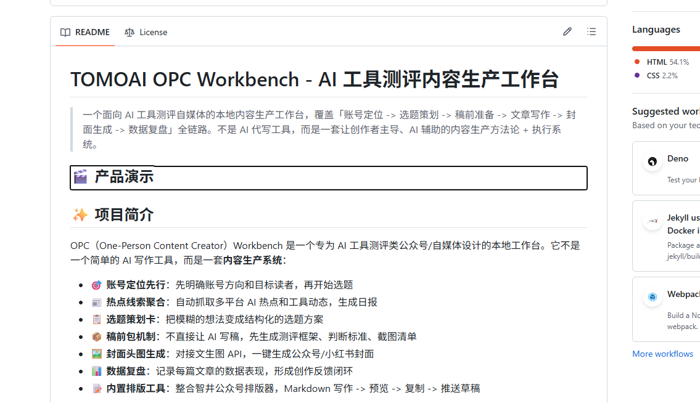

# TOMOAI OPC Workbench - AI 工具测评内容生产工作台

> 一个面向 AI 工具测评自媒体的本地内容生产工作台，覆盖「账号定位 -> 选题策划 -> 稿前准备 -> 文章写作 -> 封面生成 -> 数据复盘」全链路。不是 AI 代写工具，而是一套让创作者主导、AI 辅助的内容生产方法论 + 执行系统。

## 🎬 产品演示

<video src="https://raw.githubusercontent.com/NEKOINEKOI/tomoai-opc-workbench/main/assets/demo.mp4" poster="assets/demo-cover.png" controls="controls" width="100%" style="max-width: 800px; border-radius: 8px;">
</video>

> 如果视频无法播放，请点击 [这里](https://github.com/NEKOINEKOI/tomoai-opc-workbench/blob/main/assets/demo.mp4) 在 GitHub 页面内观看。

## 📸 产品截图



## ✨ 项目简介

OPC（One-Person Content Creator）Workbench 是一个专为 AI 工具测评类公众号/自媒体设计的本地工作台。它不是一个简单的 AI 写作工具，而是一套**内容生产系统**：

- 🎯 **账号定位先行**：先明确账号方向和目标读者，再开始选题
- 📰 **热点线索聚合**：自动抓取多平台 AI 热点和工具动态，生成日报
- 📋 **选题策划卡**：把模糊的想法变成结构化的选题方案
- 📦 **稿前包机制**：不直接让 AI 写稿，先生成测评框架、判断标准、截图清单
- 🖼️ **封面头图生成**：对接文生图 API，一键生成公众号/小红书封面
- 📊 **数据复盘**：记录每篇文章的数据表现，形成创作反馈闭环
- 📝 **内置排版工具**：整合智井公众号排版器，Markdown 写作 -> 预览 -> 复制 -> 推送草稿

所有数据存储在本地，无云端依赖，可完全离线使用（配置 AI API 后可启用智能功能）。

## 🚀 快速开始

### 环境要求

- Node.js >= 18
- npm（或 yarn/pnpm）

### 安装与运行

```bash
# 克隆项目
git clone <your-repo-url>
cd tomoai-opc-workbench

# 启动服务
npm run start
```

启动后浏览器访问：

- **OPC 工作台**：http://localhost:8788/
- **智井公众号排版工具**：http://localhost:8788/editor/

### 配置 AI Provider（可选）

平台本身可以在无 API Key 的情况下使用本地规则运行。如需启用 AI 智能功能（选题生成、稿前包、封面提示词等），有两种配置方式：

**方式一：环境变量（推荐）**

```bash
# 复制环境变量模板
Copy-Item .env.local.example .env.local   # Windows
cp .env.local.example .env.local          # macOS/Linux
```

编辑 `.env.local`，填入你的 API 配置：

```env
# OpenAI 官方或兼容中转
OPENAI_API_KEY=sk-...
OPENAI_BASE_URL=https://api.openai.com/v1
OPENAI_MODEL=gpt-4o

# 或通用中转站
AI_PROVIDER_NAME=我的中转站
AI_API_KEY=sk-...
AI_BASE_URL=https://api.example.com/v1
AI_MODEL=your-model

# 或 OpenRouter（免费模型可测试）
OPENROUTER_API_KEY=sk-or-...
OPENROUTER_MODEL=openrouter/free

# 或 Agnes AI（支持文生图）
AGNES_API_KEY=your-agnes-key
AGNES_BASE_URL=https://apihub.agnes-ai.com/v1
AGNES_MODEL=agnes-1.5-flash
AGNES_IMAGE_MODEL=agnes-image-2.0-flash
```

**方式二：前端设置页**

在工作台「AI 设置」页面中手动配置 OpenAI-compatible 的 `baseURL / apiKey / model`。

> 安全提示：服务端配置环境变量时，`/api/ai-providers` 接口只返回掩码后的 key（如 `sk-****auh`），不返回明文。

### 微信公众号推送（可选）

如需将文章直接推送到微信公众号草稿箱：

1. 在 `.env.local` 中配置公众号 AppID 和 AppSecret
2. 首次使用需要在微信公众平台配置 IP 白名单
3. 将 `data/wechat-settings.sample.json` 复制为 `data/wechat-settings.json` 并填入配置

## 🧩 功能模块

| 模块 | 功能说明 |
|------|---------|
| 总览 | 今日任务队列、系统建议下一步操作 |
| 00 账号定位 | 根据职业、经历、目标读者生成账号方向和内容策略 |
| 01 选题 | 线索池管理、AI 工具号日报（自动聚合热点）、选题策划卡生成 |
| 02 写文工作台 | 稿前包生成、文章骨架、作者风格库、IP 文章入口 |
| 03 封面头图 | 公众号封面/文章头图/小红书首图设计任务与提示词生成，支持文生图 |
| 04 数据复盘 | 文章数据记录、复盘记录、后续对接公众号数据抓取 |
| AI 设置 | 配置 OpenAI-compatible API 中转 |

## 📁 项目结构

```
tomoai-opc-workbench/
├── server.js                    # Node 本地服务（API + 静态文件）
├── index.html                   # 前端入口
├── package.json                 # 项目配置
├── .env.local.example           # 环境变量模板
├── agents/                      # Agent Skill Bundle（核心方法论）
│   ├── _shared/                 # 共享知识库
│   ├── generate-daily-digest/   # 日报生成 skill（含 knowledge/formats）
│   ├── profile-account/         # 账号定位 skill
│   ├── generate-topic-card.md   # 选题策划卡入口
│   ├── generate-brief-package.md # 稿前包入口
│   ├── check-article-before-publish.md # 发布前检查
│   ├── generate-analytics-recap.md    # 数据复盘入口
│   └── ... (更多 agent)
├── data/                        # 本地数据
│   ├── opc-workspace-template.json   # 工作区数据结构模板
│   ├── workspace.sample.json         # 空工作区示例
│   ├── local-ai-providers.sample.json # AI Provider 配置示例
│   └── wechat-settings.sample.json   # 微信公众号配置示例
├── docs/                        # 项目文档
│   ├── platform-framework.md    # 平台定位与模块分层
│   ├── module-spec.md           # 各模块输入输出规范
│   ├── content-production-framework.md # 内容生产方法论
│   └── ai-media-methodology.md  # AI 自媒体方法论
├── public/                      # 静态资源
│   ├── cover-styles/            # 封面预设样式图
│   └── editor/                  # 智井公众号排版工具
└── scripts/                     # 工具脚本
    ├── smoke-test.js            # 冒烟测试
    └── sync-wechat-publish-records.js # 微信发布记录同步
```

## 🤖 Agent Skill 系统

平台的核心能力由 `agents/` 目录下的 Markdown 文件驱动，这是一套**可扩展的 Skill Bundle 系统**：

- **单文件模式**：一个 `.md` 文件就是一个 agent，包含角色定义、输入格式、输出格式、约束条件
- **Bundle 模式**：复杂功能可升级为同名文件夹，包含 `SKILL.md`（主入口）、`knowledge/`（知识库）、`formats/`（输出格式）、`examples/`（示例）
- **读取顺序**：共享知识库（`_shared/`） -> 功能入口 `.md` -> 同名文件夹内所有 `.md`

### 已内置的 Agent

| Agent | 功能 |
|-------|------|
| `profile-account` | 账号定位测试，生成账号方向和读者画像 |
| `generate-daily-digest` | 聚合 AI 热点和工具线索，生成每日日报 |
| `generate-topic-card` | 线索/热点转化为结构化选题策划卡 |
| `generate-brief-package` | 选题卡转化为稿前包（框架、判断标准、截图清单） |
| `generate-article-skeleton/framework` | 生成文章骨架和详细框架 |
| `generate-article-draft` | 基于稿前包生成文章草稿 |
| `remove-ai-smell` | 去 AI 味，优化文章口语化表达 |
| `check-article-before-publish` | 发布前检查违禁词、事实风险、绝对化表达 |
| `generate-analytics-recap` | 基于数据生成复盘报告 |
| `generate-cover-prompt` / `chat-cover-prompt` | 封面头图提示词生成 |
| `extract-author-style` | 提取作者写作风格特征 |
| `analyze-sponsored-brief` | 分析商单 brief，生成选题建议 |

## 🔧 技术栈

- **后端**：纯 Node.js 原生 HTTP 模块（无框架依赖）
- **前端**：原生 HTML/CSS/JavaScript
- **AI 接口**：兼容 OpenAI API 格式（支持任意中转/代理）
- **数据存储**：JSON 文件 + localStorage（无数据库）
- **图片生成**：兼容 OpenAI Images API 格式

## 🎯 设计理念

### 不是 AI 代写，是 AI 辅助

平台不直接输出「可用的终稿」，而是在每个环节为创作者提供结构化的辅助：

1. **选题阶段**：AI 帮你整理热点、分析选题价值，但最终选题由你决定
2. **写作阶段**：AI 生成骨架和稿前包，但正文由你主导撰写
3. **发布阶段**：AI 帮你检查风险，但最终审稿由你把关

### 内容方法论优先

平台内置了一套完整的 AI 工具测评内容方法论（见 `docs/`）：

- 账号从一开始就面向甲方和目标读者写，不做泛 AI 资讯搬运
- 选题必须把热点加工成实践、教程、案例、对比、成本拆解、产品观察
- 每篇文章都要有真实工具、真实场景、真实结果和明确结论
- 商稿不硬吹，不夸大，保留测评可信度

### 数据全部本地化

- 所有工作数据存在本地 `data/workspace.json`
- 不向任何第三方服务器发送你的文章草稿和账号数据
- 可完全离线使用（AI 功能需要配置 API）

## 🔒 安全说明

- **API Key 安全**：前端设置页保存的 API Key 存储在浏览器 localStorage；服务端环境变量中的 Key 不会返回给前端明文
- **隐私数据**：`data/workspace.json` 包含你的所有工作数据（账号定位、文章草稿、数据复盘等），请勿提交到公开仓库
- **微信配置**：`data/wechat-settings.json` 包含公众号 AppSecret，属于敏感凭证
- 仓库中已通过 `.gitignore` 排除所有敏感文件，建议在首次使用后再次确认

## 📝 开源协议

本项目采用**非商业使用许可协议**：

- ✅ **允许**：个人使用、学习研究、复制修改、非商业性分发
- ❌ **禁止**：任何商业用途（销售、出租、集成到付费产品、提供有偿服务、商业环境使用等）
- 📋 **要求**：保留原作者署名、衍生作品须以相同协议开源

详见 [LICENSE](LICENSE) 文件。如需商业授权，请联系作者。

## 🤝 贡献

欢迎提交 Issue 和 Pull Request！

你可以通过以下方式参与贡献：

- 完善现有 agent 的提示词，提升输出质量
- 添加新的 agent skill（如多平台分发、短视频脚本等）
- 优化前端 UI/UX
- 补充文档和使用案例
- 报告 bug 或提出功能建议

### 添加自定义 Agent

在 `agents/` 目录下新建一个 `.md` 文件即可添加新的 agent。参考现有 agent 的格式：

```markdown
# 角色定义
你是一个 XXX 专家...

# 输入
- param1: 说明
- param2: 说明

# 输出格式
（JSON Schema 或 Markdown 结构）

# 约束条件
- 约束 1
- 约束 2
```

复杂功能可以创建同名文件夹，将知识库拆分到 `knowledge/` 子目录。

---

**本项目不提供任何 AI API 额度，需自行配置 API Key 使用。**
